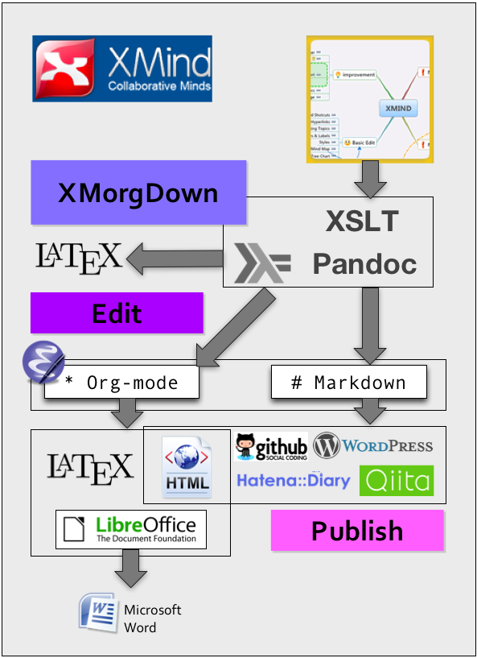

## 写作流程

### 流程描述
上图：

主要流程为：
1. 思维导图整理思绪：利用MindMap, XMind, FreeMind等来创建思维框架，思维导图来整理架构有很大优势，比如结构修改很容易（拖拽等），展示层级更清晰等。
2. 通过格式转换[Pandoc](http://pandoc.org/)，将思维导图导出为你所需要的格式，比如Markdown、LATEX等。
3. 利用顺手的文本，编辑写作，可利用第三方来进行文档托管，比如GitHub等。
4. 发布

### REF
[sky-y/xmindoc](https://github.com/sky-y/xmindoc)：Exports XMind Mindmap to any documents with Pandoc
[Pandoc - Pandoc User’s Guide](http://pandoc.org/README.html)
[vim-pandoc/vim-pandoc](https://github.com/vim-pandoc/vim-pandoc)
